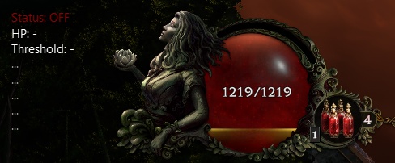
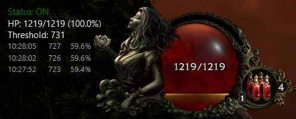

# Last Epoch Auto Potion 🧙‍♂


[]()
[](https://github.com/mhammond/pywin32)

A Windows overlay tool for Last Epoch that automatically uses potions when your HP drops below a configurable threshold. Features a PyQt5 overlay, hotkey controls, and direct memory reading for reliable automation.

**⚠️Warning**: This tool is intended for offline use. While it may work online, use it at your own discretion and risk.

Based on [Skalety's Auto Potion](https://www.unknowncheats.me/forum/other-mmorpg-and-strategy/699378-epoch-auto-potion-copied-games.html) <3


**A few important notes:**
- While it’s not a guarantee of survival, it will save you most of the time. It works with any class or build, just make sure you always have enough potions!
- Because of how the game handles health and damage over time (DoT), if you take a lot of DoT or very fast hits, your HP can drop below the threshold very quickly, multiple times or stay below the threshold even with potion drinks.
- The potion will trigger as soon as your real HP drops, but if the accumulated or incoming damage is higher than what a potion can heal, you might still die.
- Be careful with heavy DoT or burst damage—there’s always a chance the damage is more than what a potion can save you from.


## ✨ Features
<p align="center">
  
  
</p>

- **Auto Potion**: Automatically triggers a potion when HP falls below a set percentage.
- **Potion log**: The overlay displays a log of recent potion uses, showing HP values and timestamps for each use.
- **Overlay UI**: Movable, lockable PyQt5 overlay showing status, HP, and logs.
- **Customizable Hotkeys**: Easily change hotkeys for toggling, hiding, and closing the overlay.
- **Safe & Configurable**: All settings in a user-friendly config file.


## 🛠️ Setup Instructions

You can use the tool in three ways:

### 1. Download the Executable
- Download the latest release from the [Releases page](https://github.com/leobrqz/LE-AutoPot/releases).
- Run the `.exe` file directly (no Python required).

### 2. Build the Executable Yourself
- Clone the repository:
  ```bash
  git clone https://github.com/leobrqz/LE-AutoPot
  cd LE-AutoPot
  ```
- Install dependencies:
  ```bash
  pip install -r requirements.txt
  ```
- Build the executable with PyInstaller:
  ```bash
  build_release.sh
  ```
- The executable will be in the `release/` folder.

### 3. Run Natively with Python
- Clone the repository:
  ```bash
  git clone git clone https://github.com/leobrqz/LE-AutoPot
  cd LE-AutoPot
  ```
- Install dependencies:
  ```bash
  pip install -r requirements.txt
  ```
- Run the application:
  ```bash
  python src/main.py
  ```


## ⚙️ Configuration
- **config_user.ini** is auto-generated on first run.
- Change hotkeys, potion key, HP threshold, cooldown, and overlay position in this file.
- Default hotkeys:
  - Toggle: `num /`
  - Close: `ctrl+alt+num -`
  - Hide/Show: `ctrl+alt+num /`
  - Lock/Unlock Move: `ctrl+alt+num *`
- Default potion settings:
  - Potion Key: `1` 
  - Potion Cooldown: `0.2` s
  - HP Threshold: `0.6` (60%)
  - Stable HP Duration: `5.0` s
- Overlay settings:
  - Default position on bottom left corner before the player health
  - INITIAL_POS_X: 200
  - INITIAL_POS_Y: 880


## Credits

Check out [Skalety's Auto Potion](https://www.unknowncheats.me/forum/other-mmorpg-and-strategy/699378-epoch-auto-potion-copied-games.html) 


